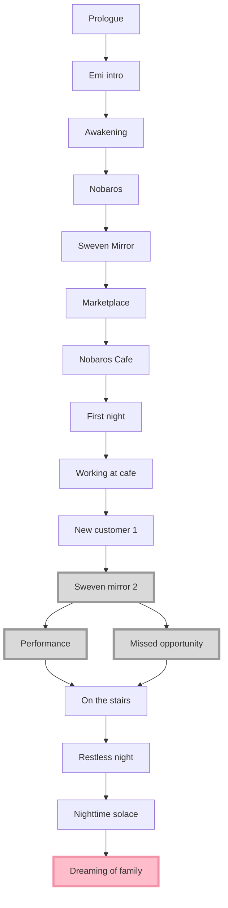

```mermaid
graph TD

%% Define aliases
prologue[Prologue]
CH1[Emi intro]
awakening[Awakening]
nobaros[Nobaros]
marketplace[Marketplace]
nobaros-cafe[Nobaros Cafe]
sweven-mirror[Sweven Mirror]
first-night[First night]
work-cafe[Working at cafe]
customer1[New customer 1]
mirror1[Sweven mirror 2]
success-sgm[Performance]
fail-sgm[Missed opportunity]
staircase[On the stairs]
restless-night[Restless night]
chat-ingram[Nighttime solace]
family-dreams[Dreaming of family]

%% Define node formatting for routes
classDef spirit-route fill:#d9d9d9,stroke:#999999,stroke-width:4px
classDef emi-route fill:#ffbcca,stroke:#f393a7,stroke-width:4px
classDef ingram-route fill:#9fe7ff,stroke:#78bff1,stroke-width:4px
classDef kai-route fill:#fad5af,stroke:#faac5f,stroke-width:4px
classDef akira-route fill:#c7f5c5,stroke:#86c083,stroke-width:4px
classDef annelise-route fill:#fff2cc,stroke:#efcd7b,stroke-width:4px

%% Establish node connections
prologue-->CH1-->awakening-->nobaros-->sweven-mirror-->marketplace-->nobaros-cafe
nobaros-cafe-->first-night-->work-cafe-->customer1-->mirror1
mirror1-->success-sgm-->staircase
mirror1-->fail-sgm-->staircase
staircase-->restless-night-->chat-ingram-->family-dreams


%% Format the routes & link to script files accordingly
%%---------------------------------------------------------------------------
%% General storyline
class family-dreams emi-route
class prologue,CH1,awakening,nobaros,marketplace,nobaros-cafe,sweven-mirror,first-night,work-cafe,customer1,staircase,restless-night,chat-ingram,family-dreams internal-link

%% Spiritguiding
class mirror1,success-sgm,fail-sgm spirit-route
class mirror1,success-sgm,fail-sgm internal-link

```

