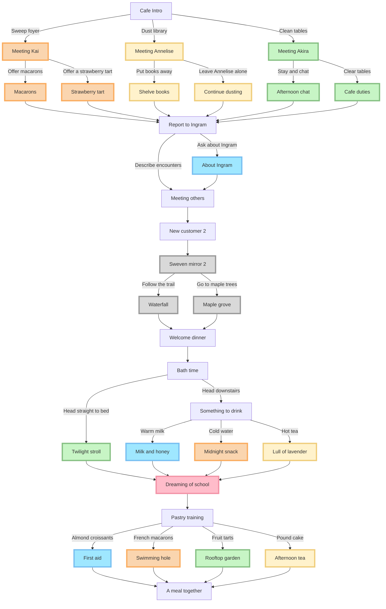

```mermaid
graph TD

%% Define aliases
CH2[Cafe Intro]
meet-kai[Meeting Kai]
macarons-kai[Macarons]
strawberry-kai[Strawberry tart]
meet-annelise[Meeting Annelise]
shelve-annelise[Shelve books]
dust-annelise[Continue dusting]
meet-akira[Meeting Akira]
clean-akira[Cafe duties]
chat-akira[Afternoon chat]
report-ingram[Report to Ingram]
ingram-job[About Ingram]
meeting-others[Meeting others]
customer2[New customer 2]
mirror2[Sweven mirror 2]
waterfall[Waterfall]
maple[Maple grove]
celebrate-dinner[Welcome dinner]
bathtime[Bath time]
choose-drink[Something to drink]
night-ingram[Milk and honey]
night-annelise[Lull of lavender]
night-kai[Midnight snack]
night-akira[Twilight stroll]
school-dreams[Dreaming of school]
masterchef[Pastry training]
sweets-ingram[First aid]
sweets-kai[Swimming hole]
sweets-akira[Rooftop garden]
sweets-annelise[Afternoon tea]
group-dinner[A meal together]

%% Define node formatting for routes
classDef spirit-route fill:#d9d9d9,stroke:#999999,stroke-width:4px
classDef emi-route fill:#ffbcca,stroke:#f393a7,stroke-width:4px
classDef ingram-route fill:#9fe7ff,stroke:#78bff1,stroke-width:4px
classDef kai-route fill:#fad5af,stroke:#faac5f,stroke-width:4px
classDef akira-route fill:#c7f5c5,stroke:#86c083,stroke-width:4px
classDef annelise-route fill:#fff2cc,stroke:#efcd7b,stroke-width:4px

%% Establish node connections
CH2--Sweep foyer-->meet-kai
meet-kai--Offer macarons-->macarons-kai-->report-ingram
meet-kai--Offer a strawberry tart-->strawberry-kai-->report-ingram
CH2--Dust library-->meet-annelise
meet-annelise--Put books away-->shelve-annelise-->report-ingram
meet-annelise--Leave Annelise alone-->dust-annelise-->report-ingram
CH2--Clean tables-->meet-akira
meet-akira--Stay and chat-->chat-akira-->report-ingram
meet-akira--Clear tables-->clean-akira-->report-ingram
report-ingram--Describe encounters-->meeting-others
report-ingram--Ask about Ingram-->ingram-job-->meeting-others
meeting-others-->customer2-->mirror2--Follow the trail-->waterfall
mirror2--Go to maple trees-->maple
maple & waterfall-->celebrate-dinner
celebrate-dinner-->bathtime
bathtime--Head straight to bed-->night-akira
bathtime--Head downstairs-->choose-drink
choose-drink--Warm milk-->night-ingram
choose-drink--Cold water-->night-kai
choose-drink--Hot tea-->night-annelise
night-ingram & night-kai & night-akira & night-annelise-->school-dreams
school-dreams-->masterchef
masterchef--Almond croissants-->sweets-ingram
masterchef--French macarons-->sweets-kai
masterchef--Fruit tarts-->sweets-akira
masterchef--Pound cake-->sweets-annelise
sweets-ingram & sweets-kai & sweets-akira & sweets-annelise-->group-dinner

%% Format the routes & link to script files accordingly
%%---------------------------------------------------------------------------
%% General storyline
class school-dreams emi-route
class CH2,report-ingram,meeting-others,customer2,mirror2,pond,sakura,celebrate-dinner,bathtime,choose-drink,school-dreams,masterchef,group-dinner internal-link

%% Spiritguiding
class mirror2,waterfall,maple spirit-route
class mirror2,waterfall,maple internal-link

%% Ingram route
class ingram-job,night-ingram,sweets-ingram ingram-route
class ingram-job,night-ingram,sweets-ingram internal-link

%% Kai route
class meet-kai,macarons-kai,strawberry-kai,night-kai,sweets-kai kai-route
class meet-kai,macarons-kai,strawberry-kai,night-kai,sweets-kai internal-link

%% Annelise route
class meet-annelise,shelve-annelise,dust-annelise,night-annelise,sweets-annelise annelise-route
class meet-annelise,shelve-annelise,dust-annelise,night-annelise,sweets-annelise internal-link

%% Akira route
class meet-akira,clean-akira,chat-akira,night-akira,sweets-akira akira-route
class meet-akira,clean-akira,chat-akira,night-akira,sweets-akira internal-link

```

