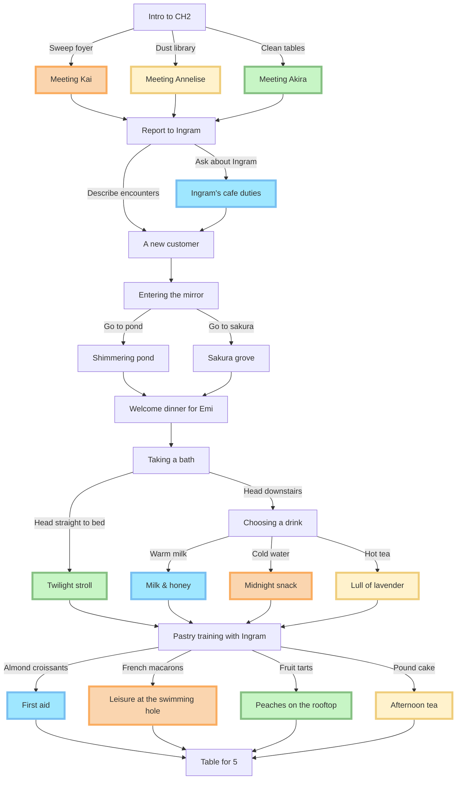

```mermaid
graph TD

%% Define aliases
CH2[Intro to CH2]
meet-kai[Meeting Kai]
meet-annelise[Meeting Annelise]
meet-akira[Meeting Akira]
report-ingram[Report to Ingram]
ingram-job[Ingram's cafe duties]
customer2[A new customer]
mirror2[Entering the mirror]
pond[Shimmering pond]
sakura[Sakura grove]
celebrate-dinner[Welcome dinner for Emi]
bathtime[Taking a bath]
choose-drink[Choosing a drink]
night-ingram[Milk & honey]
night-annelise[Lull of lavender]
night-kai[Midnight snack]
night-akira[Twilight stroll]
masterchef[Pastry training with Ingram]
sweets-ingram[First aid]
sweets-kai[Leisure at the swimming hole]
sweets-akira[Peaches on the rooftop]
sweets-annelise[Afternoon tea]
group-dinner[Table for 5]

%% Define node formatting for routes
classDef ingram-route fill:#9fe7ff,stroke:#78bff1,stroke-width:4px
classDef kai-route fill:#fad5af,stroke:#faac5f,stroke-width:4px
classDef akira-route fill:#c7f5c5,stroke:#86c083,stroke-width:4px
classDef annelise-route fill:#fff2cc,stroke:#efcd7b,stroke-width:4px

%% Establish node connections
CH2--Sweep foyer-->meet-kai-->report-ingram
CH2--Dust library-->meet-annelise-->report-ingram
CH2--Clean tables-->meet-akira-->report-ingram
report-ingram--Describe encounters-->customer2
report-ingram--Ask about Ingram-->ingram-job-->customer2
customer2-->mirror2--Go to pond-->pond
mirror2--Go to sakura--> sakura
sakura & pond-->celebrate-dinner
celebrate-dinner-->bathtime
bathtime--Head straight to bed-->night-akira
bathtime--Head downstairs-->choose-drink
choose-drink--Warm milk-->night-ingram
choose-drink--Cold water-->night-kai
choose-drink--Hot tea-->night-annelise
night-ingram & night-kai & night-akira & night-annelise-->masterchef
masterchef--Almond croissants-->sweets-ingram
masterchef--French macarons-->sweets-kai
masterchef--Fruit tarts-->sweets-akira
masterchef--Pound cake-->sweets-annelise
sweets-ingram & sweets-kai & sweets-akira & sweets-annelise-->group-dinner

%% Format the routes & link to script files accordingly
%%---------------------------------------------------------------------------
%% General storyline
class CH2,report-ingram,customer2,mirror2,pond,sakura,celebrate-dinner,bathtime,choose-drink,masterchef,group-dinner internal-link

%% Spiritguiding
class mirror2,pond,sakura internal-link

%% Ingram route
class ingram-job,night-ingram,sweets-ingram ingram-route
class ingram-job,night-ingram,sweets-ingram internal-link

%% Kai route
class meet-kai,night-kai,sweets-kai kai-route
class meet-kai,night-kai,sweets-kai internal-link

%% Annelise route
class meet-annelise,night-annelise,sweets-annelise annelise-route
class meet-annelise,night-annelise,sweets-annelise internal-link

%% Akira route
class meet-akira,night-akira,sweets-akira akira-route
class meet-akira,night-akira,sweets-akira internal-link

```

