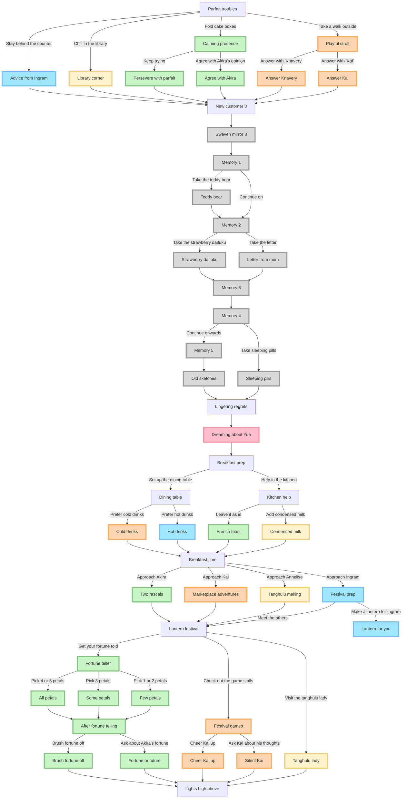

```mermaid
graph TD

%% Define aliases
CH3[Parfait troubles]
break-kai[Playful stroll]
kai-kai[Answer Kai]
knavery-kai[Answer Knavery]
break-akira[Calming presence]
agree-akira[Agree with Akira]
persevere-akira[Persevere with parfait]
break-annelise[Library corner]
break-ingram[Advice from Ingram]
customer3[New customer 3]
mirror3[Sweven mirror 3]
memory1[Memory 1]
memory2[Memory 2]
memory3[Memory 3]
memory4[Memory 4]
memory5[Memory 5]
teddy-bear[Teddy bear]
moms-letter[Letter from mom]
strawberry-daifuku[Strawberry daifuku]
sleeping-pills[Sleeping pills]
old-sketches[Old sketches]
lingering-regrets[Lingering regrets]
yua-dreams[Dreaming about Yua]
breakfast-prep[Breakfast prep]
cooking-kitchen[Kitchen help]
cooking-annelise[Condensed milk]
cooking-akira[French toast]
dining-table[Dining table]
dining-ingram[Hot drinks]
dining-kai[Cold drinks]
breakfast-time[Breakfast time]
day-annelise[Tanghulu making]
day-kai[Marketplace adventures]
day-akira[Two rascals]
day-ingram[Festival prep]
lantern-festival[Lantern festival]
lantern-annelise[Tanghulu lady]
lantern-kai[Festival games]
ask-kai[Silent Kai]
cheer-kai[Cheer Kai up]
lantern-akira[Fortune teller]
one-akira[Few petals]
three-akira[Some petals]
five-akira[All petals]
post-akira[After fortune telling]
fortune-akira[Fortune or future]
brush-akira[Brush fortune off]
lantern-ingram[Lantern for you]
lantern-end[Lights high above]

%% Define node formatting for routes
classDef spirit-route fill:#d9d9d9,stroke:#999999,stroke-width:4px
classDef emi-route fill:#ffbcca,stroke:#f393a7,stroke-width:4px
classDef ingram-route fill:#9fe7ff,stroke:#78bff1,stroke-width:4px
classDef kai-route fill:#fad5af,stroke:#faac5f,stroke-width:4px
classDef akira-route fill:#c7f5c5,stroke:#86c083,stroke-width:4px
classDef annelise-route fill:#fff2cc,stroke:#efcd7b,stroke-width:4px

%% Establish node connections
CH3--Take a walk outside-->break-kai
break-kai--Answer with 'Kai'-->kai-kai-->customer3
break-kai--Answer with 'Knavery'-->knavery-kai-->customer3
CH3--Fold cake boxes-->break-akira
break-akira--Agree with Akira's opinion-->agree-akira-->customer3
break-akira--Keep trying-->persevere-akira-->customer3
CH3--Chill in the library-->break-annelise
CH3--Stay behind the counter-->break-ingram
break-annelise & break-ingram-->customer3
customer3-->mirror3
mirror3-->memory1--Take the teddy bear-->teddy-bear
memory1--Continue on-->memory2
teddy-bear-->memory2--Take the letter-->moms-letter
memory2--Take the strawberry daifuku-->strawberry-daifuku
moms-letter & strawberry-daifuku-->memory3-->memory4
memory4--Take sleeping pills-->sleeping-pills
memory4--Continue onwards-->memory5-->old-sketches
sleeping-pills & old-sketches-->lingering-regrets-->yua-dreams-->breakfast-prep
breakfast-prep--Help in the kitchen-->cooking-kitchen
cooking-kitchen--Add condensed milk-->cooking-annelise
cooking-kitchen--Leave it as is-->cooking-akira
breakfast-prep--Set up the dining table-->dining-table
dining-table--Prefer hot drinks-->dining-ingram
dining-table--Prefer cold drinks-->dining-kai
cooking-annelise & cooking-akira & dining-ingram & dining-kai-->breakfast-time
breakfast-time--Approach Annelise-->day-annelise
breakfast-time--Approach Kai-->day-kai
breakfast-time--Approach Akira-->day-akira
breakfast-time--Approach Ingram-->day-ingram
day-ingram--Make a lantern for Ingram-->lantern-ingram
day-ingram--Meet the others-->lantern-festival
day-annelise & day-kai & day-akira-->lantern-festival
lantern-festival--Visit the tanghulu lady-->lantern-annelise-->lantern-end
lantern-festival--Check out the game stalls-->lantern-kai
lantern-kai--Ask Kai about his thoughts-->ask-kai-->lantern-end
lantern-kai--Cheer Kai up-->cheer-kai-->lantern-end
lantern-festival--Get your fortune told-->lantern-akira
lantern-akira--Pick 1 or 2 petals-->one-akira-->post-akira
lantern-akira--Pick 3 petals-->three-akira-->post-akira
lantern-akira--Pick 4 or 5 petals-->five-akira-->post-akira
post-akira--Ask about Akira's fortune-->fortune-akira-->lantern-end
post-akira--Brush fortune off-->brush-akira-->lantern-end

%% Format the routes & link to script files accordingly
%%---------------------------------------------------------------------------
%% General storyline
class yua-dreams emi-route
class CH3,customer3,lingering-regrets,yua-dreams,breakfast-prep,cooking-kitchen,dining-table,breakfast-time,lantern-festival,lantern-end internal-link

%% Spiritguiding
class mirror3,memory1,memory2,memory3,memory4,memory5,teddy-bear,moms-letter,strawberry-daifuku,sleeping-pills,old-sketches spirit-route
class mirror3,memory1,memory2,memory3,memory4,memory5,teddy-bear,moms-letter,strawberry-daifuku,sleeping-pills,old-sketches internal-link

%% Ingram route
class break-ingram,dining-ingram,day-ingram,lantern-ingram ingram-route
class break-ingram,dining-ingram,day-ingram,lantern-ingram internal-link

%% Kai route
class break-kai,kai-kai,knavery-kai,dining-kai,day-kai,lantern-kai,ask-kai,cheer-kai kai-route
class break-kai,kai-kai,knavery-kai,dining-kai,day-kai,lantern-kai,ask-kai,cheer-kai internal-link

%% Annelise route
class break-annelise,cooking-annelise,day-annelise,lantern-annelise annelise-route
class break-annelise,cooking-annelise,day-annelise,lantern-annelise internal-link

%% Akira route
class break-akira,agree-akira,persevere-akira,cooking-akira,day-akira,lantern-akira,one-akira,three-akira,five-akira,post-akira,fortune-akira,brush-akira akira-route
class break-akira,agree-akira,persevere-akira,cooking-akira,day-akira,lantern-akira,one-akira,three-akira,five-akira,post-akira,fortune-akira,brush-akira internal-link

```

