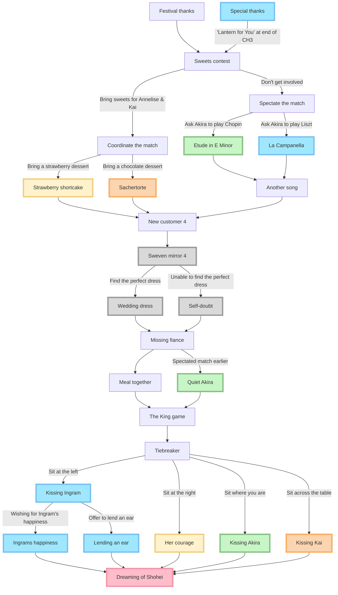

```mermaid
graph TD

%% Define aliases
CH4[Festival thanks]
CH4-ingram[Special thanks]
sweets-contest[Sweets contest]
spectate-match[Spectate the match]
sweets-akira[Etude in E Minor]
sweets-ingram[La Campanella]
spectate-finish[Another song]
judge-sweets[Coordinate the match]
sweets-annelise[Strawberry shortcake]
sweets-kai[Sachertorte]
customer4[New customer 4]
mirror4[Sweven mirror 4]
good-dress[Wedding dress]
bad-dress[Self-doubt]
missing-fiance[Missing fiance]
dinner[Meal together]
dinner-akira[Quiet Akira]
kings-game[The King game]
tiebreaker[Tiebreaker]
king-kai[Kissing Kai]
king-akira[Kissing Akira]
king-ingram[Kissing Ingram]
happy-ingram[Ingrams happiness]
comfort-ingram[Lending an ear]
king-annelise[Her courage]
shohei-dreams[Dreaming of Shohei]

%% Define node formatting for routes
classDef spirit-route fill:#d9d9d9,stroke:#999999,stroke-width:4px
classDef emi-route fill:#ffbcca,stroke:#f393a7,stroke-width:4px
classDef ingram-route fill:#9fe7ff,stroke:#78bff1,stroke-width:4px
classDef kai-route fill:#fad5af,stroke:#faac5f,stroke-width:4px
classDef akira-route fill:#c7f5c5,stroke:#86c083,stroke-width:4px
classDef annelise-route fill:#fff2cc,stroke:#efcd7b,stroke-width:4px

%% Establish node connections
CH4-->sweets-contest
CH4-ingram--'Lantern for You' at end of CH3-->sweets-contest
sweets-contest--Don't get involved-->spectate-match
spectate-match--Ask Akira to play Chopin-->sweets-akira
spectate-match--Ask Akira to play Liszt-->sweets-ingram
sweets-akira & sweets-ingram-->spectate-finish
sweets-contest--Bring sweets for Annelise & Kaio-->judge-sweets
judge-sweets--Bring a strawberry dessert-->sweets-annelise
judge-sweets--Bring a chocolate dessert-->sweets-kai
sweets-annelise & sweets-kai & spectate-finish-->customer4-->mirror4
mirror4--Find the perfect dress-->good-dress
mirror4--Unable to find the perfect dress-->bad-dress
good-dress & bad-dress-->missing-fiance-->dinner-->kings-game-->tiebreaker
missing-fiance--Spectated match earlier-->dinner-akira-->kings-game
tiebreaker--Sit at the right-->king-annelise
tiebreaker--Sit at the left-->king-ingram
king-ingram--Wishing for Ingram's happiness-->happy-ingram-->shohei-dreams
king-ingram--Offer to lend an ear-->comfort-ingram-->shohei-dreams
tiebreaker--Sit where you are-->king-akira
tiebreaker--Sit across the table-->king-kai
king-annelise & king-akira & king-kai-->shohei-dreams

%% Format the routes & link to script files accordingly
%%---------------------------------------------------------------------------
%% General storyline
class shohei-dreams emi-route
class CH4,sweets-contest,spectate-match,spectate-finish,judge-sweets,customer4,missing-fiance,dinner,kings-game,shohei-dreams,tiebreaker internal-link

%% Spiritguiding
class mirror4,good-dress,bad-dress spirit-route
class mirror4,good-dress,bad-dress internal-link

%% Ingram route
class CH4-ingram,sweets-ingram,king-ingram,happy-ingram,comfort-ingram ingram-route
class CH4-ingram,sweets-ingram,king-ingram,happy-ingram,comfort-ingram internal-link

%% Kai route
class sweets-kai,king-kai kai-route
class sweets-kai,king-kai internal-link

%% Annelise route
class sweets-annelise,king-annelise annelise-route
class sweets-annelise,king-annelise internal-link

%% Akira route
class sweets-akira,dinner-akira,king-akira akira-route
class sweets-akira,dinner-akira,king-akira internal-link

```
