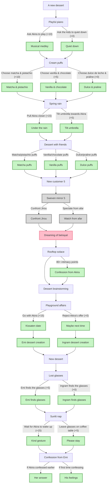

```mermaid
graph TD

%% Define aliases
CH5[A new dessert]
playful-piano[Playful piano]
play-along[Musical medley]
quiet-down[Quiet down]
cream-puffs[Cream puffs]
matcha-pistachio[Matcha & pistachio]
vanilla-choco[Vanilla & chocolate]
dulce-praline[Dulce & praline]
spring-rain[Spring rain]
pull-akira[Under the rain]
tilt-umbrella[Tilt umbrella]
dessert-group[Dessert with friends]
good-puffs[Matcha puffs]
ok-puffs[Vanilla puffs]
bad-puffs[Dulce puffs]
customer5[New customer 5]
mirror5[Sweven mirror 5]
confrontation[Confront Jirou]
spectate[Watch from afar]
backstab-dreams[Dreaming of betrayal]
rooftop-solace[Rooftop solace]
confession-akira[Confession from Akira]
dessert-brainstorm[Dessert brainstorming]
playground[Playground affairs]
kissaten-date[Kissaten date]
go-home[Maybe next time]
dessert-emi[Emi dessert creation]
dessert-ingram[Ingram dessert creation]
first-taste[New dessert]
lost-glasses[Lost glasses]
glasses-emi[Emi finds glasses]
glasses-ingram[Ingram finds glasses]
sunlit-nap[Sunlit nap]
wait-akira[Kind gesture]
coffee-table[Please stay]
confession-emi[Confession from Emi]
response-akira[His feelings]
answer-emi[Her answer]

%% Define node formatting for routes
classDef spirit-route fill:#d9d9d9,stroke:#999999,stroke-width:4px
classDef emi-route fill:#ffbcca,stroke:#f393a7,stroke-width:4px
classDef akira-route fill:#c7f5c5,stroke:#86c083,stroke-width:4px

%% Establish node connections
CH5-->playful-piano
playful-piano--Ask Akira to play (+10)-->play-along-->cream-puffs
playful-piano--Ask the kids to quiet down (+0)-->quiet-down-->cream-puffs
cream-puffs--Choose matcha & pistachio (+10)-->matcha-pistachio
cream-puffs--Choose vanilla & chocolate (+5)-->vanilla-choco
cream-puffs--Choose dulce de leche & praline (+0)-->dulce-praline
matcha-pistachio & vanilla-choco & dulce-praline-->spring-rain
spring-rain--Pull Akira closer (+15)-->pull-akira
spring-rain--Tilt umbrella towards Akira (+5)-->tilt-umbrella
pull-akira & tilt-umbrella-->dessert-group
dessert-group--Matcha/pistachio puffs-->good-puffs-->customer5
dessert-group--Vanilla/chocolate puffs-->ok-puffs-->customer5
dessert-group--Dulce/praline puffs-->bad-puffs-->customer5
customer5-->mirror5--Confront Jirou-->confrontation-->backstab-dreams
mirror5--Spectate from afar-->spectate-->backstab-dreams
backstab-dreams-->rooftop-solace-->dessert-brainstorm
rooftop-solace--80+ intimacy points-->confession-akira-->dessert-brainstorm
dessert-brainstorm-->playground
playground--Go with Akira (+15)-->kissaten-date-->dessert-emi
playground--Reject Akira's offer (+0)-->go-home-->dessert-ingram
dessert-emi & dessert-ingram-->first-taste-->lost-glasses
lost-glasses--Emi finds the glasses (+5)-->glasses-emi-->sunlit-nap
lost-glasses--Ingram finds the glasses (+0)-->glasses-ingram-->sunlit-nap
sunlit-nap--Wait for Akira to wake up (+15)-->wait-akira
sunlit-nap--Leave glasses on coffee table (+5)-->coffee-table
wait-akira & coffee-table-->confession-emi
confession-emi--If Akira confessed earlier-->answer-emi
confession-emi--If first time confessing-->response-akira

%% Format the routes & link to script files accordingly
%%---------------------------------------------------------------------------
%% General storyline
class backstab-dreams emi-route
class CH5,playful-piano,cream-puffs,spring-rain,dessert-group,customer5,backstab-dreams,rooftop-solace,dessert-brainstorm,playground,first-taste,lost-glasses,sunlit-nap,confession-emi internal-link

%% Spiritguiding
class mirror5,confrontation,spectate spirit-route
class mirror5,confrontation,spectate internal-link

%% Akira decisions
class play-along,quiet-down,matcha-pistachio,vanilla-choco,dulce-praline,pull-akira,tilt-umbrella,good-puffs,ok-puffs,bad-puffs,confession-akira,dessert-emi,dessert-ingram,kissaten-date,go-home,glasses-emi,glasses-ingram,wait-akira,coffee-table,answer-emi,response-akira akira-route
class play-along,quiet-down,matcha-pistachio,vanilla-choco,dulce-praline,pull-akira,tilt-umbrella,good-puffs,ok-puffs,bad-puffs,confession-akira,dessert-emi,dessert-ingram,kissaten-date,go-home,glasses-emi,glasses-ingram,wait-akira,coffee-table,answer-emi,response-akira internal-link

```
