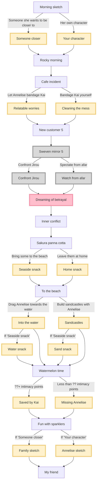

```mermaid
graph TD

%% Define aliases
CH5[Morning sketch]
someone-closer[Someone closer]
your-chara[Your character]
rocky-morning[Rocky morning]
cafe-incident[Cafe incident]
relatable-worries[Relatable worries]
clean-mess[Cleaning the mess]
customer5[New customer 5]
mirror5[Sweven mirror 5]
confrontation[Confront Jirou]
spectate[Watch from afar]
backstab-dreams[Dreaming of betrayal]
inner-conflict[Inner conflict]
sakura-pc[Sakura panna cotta]
seaside-snack[Seaside snack]
home-snack[Home snack]
to-the-beach[To the beach]
into-the-water[Into the water]
water-snack[Water snack]
sandcastles[Sandcastles]
sand-snack[Sand snack]
watermelon-time[Watermelon time]
saved-by-kai[Saved by Kai]
missing-annelise[Missing Annelise]
fun-with-sparklers[Fun with sparklers]
annelise-sketch[Annelise sketch]
family-sketch[Family sketch]
my-friend[My friend]

%% Define node formatting for routes
classDef spirit-route fill:#d9d9d9,stroke:#999999,stroke-width:4px
classDef emi-route fill:#ffbcca,stroke:#f393a7,stroke-width:4px
classDef annelise-route fill:#fff2cc,stroke:#efcd7b,stroke-width:4px

%% Establish node connections
CH5--Someone she wants to be closer to -->someone-closer
CH5--Her own character-->your-chara
someone-closer & your-chara-->rocky-morning-->cafe-incident
cafe-incident--Let Annelise bandage Kai-->relatable-worries
cafe-incident--Bandage Kai yourself-->clean-mess
relatable-worries & clean-mess-->customer5-->mirror5
mirror5--Confront Jirou-->confrontation-->backstab-dreams
mirror5--Spectate from afar-->spectate-->backstab-dreams
backstab-dreams-->inner-conflict-->sakura-pc
sakura-pc--Bring some to the beach-->seaside-snack
sakura-pc--Leave them at home-->home-snack
seaside-snack & home-snack-->to-the-beach
to-the-beach--Drag Annelise towards the water-->into-the-water
into-the-water--If 'Seaside snack'-->water-snack
to-the-beach--Build sandcastles with Annelise-->sandcastles
sandcastles--If 'Seaside snack'-->sand-snack
water-snack & into-the-water & sand-snack & sandcastles -->watermelon-time
watermelon-time--??+ intimacy points-->saved-by-kai
watermelon-time--Less than ?? intimacy points-->missing-annelise
saved-by-kai & missing-annelise-->fun-with-sparklers
fun-with-sparklers--If 'Someone closer' -->family-sketch
fun-with-sparklers--If 'Your character'-->annelise-sketch
family-sketch & annelise-sketch-->my-friend

%% Format the routes & link to script files accordingly
%%---------------------------------------------------------------------------
%% General storyline
class backstab-dreams emi-route
class CH5,rocky-morning,cafe-incident,customer5,backstab-dreams,inner-conflict,sakura-pc,to-the-beach,watermelon-time,fun-with-sparklers,my-friend internal-link

%% Spiritguiding
class mirror5,confrontation,spectate spirit-route
class mirror5,confrontation,spectate internal-link

%% Annelise route
class someone-closer,your-chara,relatable-worries,clean-mess,seaside-snack,home-snack,into-the-water,sandcastles,water-snack,sand-snack,saved-by-kai,missing-annelise,family-sketch,annelise-sketch annelise-route
class someone-closer,your-chara,relatable-worries,clean-mess,seaside-snack,home-snack,into-the-water,sandcastles,water-snack,sand-snack,saved-by-kai,missing-annelise,family-sketch,annelise-sketch internal-link

```
