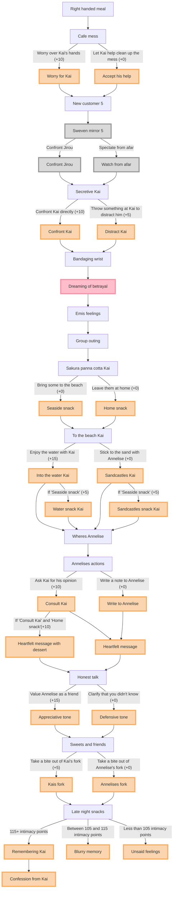

```mermaid
graph TD

%% Define aliases
CH5[Right handed meal]
cafe-mess[Cafe mess]
kais-hands[Worry for Kai]
kais-help[Accept his help]
customer5[New customer 5]
mirror5[Sweven mirror 5]
confrontation[Confront Jirou]
spectate[Watch from afar]
secretive-kai[Secretive Kai]
confront-kai[Confront Kai]
distract-kai[Distract Kai]
bandaging-kai[Bandaging wrist]
backstab-dreams[Dreaming of betrayal]
emis-feelings[Emis feelings]
group-outing[Group outing]
sakura-pc[Sakura panna cotta Kai]
seaside-snack[Seaside snack]
home-snack[Home snack]
to-the-beach[To the beach Kai]
into-the-water[Into the water Kai]
water-snack[Water snack Kai]
sandcastles[Sandcastles Kai]
sandcastles-snack[Sandcastles snack Kai]
wheres-annelise[Wheres Annelise]
annelises-actions[Annelises actions]
consult-kai[Consult Kai]
write-note[Write to Annelise]
heartfelt-message-pc[Heartfelt message with dessert]
heartfelt-message[Heartfelt message]
honest-talk[Honest talk]
appreciative-tone[Appreciative tone]
defensive-tone[Defensive tone]
sweets-friends[Sweets and friends]
fork-kai[Kais fork]
fork-annelise[Annelises fork]
late-night-snacks[Late night snacks]
remembering-kai[Remembering Kai]
confession-kai[Confession from Kai]
blurry-memory[Blurry memory]
unsaid-feelings[Unsaid feelings]

%% Define node formatting for routes
classDef spirit-route fill:#d9d9d9,stroke:#999999,stroke-width:4px
classDef emi-route fill:#ffbcca,stroke:#f393a7,stroke-width:4px
classDef kai-route fill:#fad5af,stroke:#faac5f,stroke-width:4px

%% Establish node connections
CH5-->cafe-mess--Worry over Kai's hands (+10)-->kais-hands-->customer5
cafe-mess--Let Kai help clean up the mess (+0)-->kais-help-->customer5
customer5-->mirror5--Confront Jirou-->confrontation-->secretive-kai
mirror5--Spectate from afar-->spectate-->secretive-kai
secretive-kai--Confront Kai directly (+10)-->confront-kai-->bandaging-kai
secretive-kai--Throw something at Kai to distract him (+5)-->distract-kai-->bandaging-kai
bandaging-kai-->backstab-dreams-->emis-feelings-->group-outing-->sakura-pc
sakura-pc--Bring some to the beach (+0)-->seaside-snack-->to-the-beach
sakura-pc--Leave them at home (+0)-->home-snack-->to-the-beach
to-the-beach--Enjoy the water with Kai (+15)-->into-the-water-->wheres-annelise
into-the-water--If 'Seaside snack' (+5)-->water-snack
to-the-beach--Stick to the sand with Annelise (+0)-->sandcastles-->wheres-annelise
sandcastles--If 'Seaside snack' (+5)-->sandcastles-snack
water-snack & sandcastles-snack-->wheres-annelise-->annelises-actions
annelises-actions--Ask Kai for his opinion (+10)-->consult-kai
consult-kai--If 'Consult Kai' and 'Home snack'(+10)-->heartfelt-message-pc-->honest-talk
annelises-actions--Write a note to Annelise (+0)-->write-note
consult-kai & write-note-->heartfelt-message-->honest-talk
honest-talk--Value Annelise as a friend (+15)-->appreciative-tone
honest-talk--Clarify that you didn't know (+0)-->defensive-tone
appreciative-tone & defensive-tone-->sweets-friends
sweets-friends--Take a bite out of Kai's fork (+5)-->fork-kai
sweets-friends--Take a bite out of Annelise's fork (+0)-->fork-annelise
fork-kai & fork-annelise-->late-night-snacks
late-night-snacks--115+ intimacy points-->remembering-kai-->confession-kai
late-night-snacks--Between 105 and 115 intimacy points-->blurry-memory
late-night-snacks--Less than 105 intimacy points-->unsaid-feelings

%% Format the routes & link to script files accordingly
%%---------------------------------------------------------------------------
%% General storyline
class backstab-dreams emi-route
class CH5,cafe-mess,customer5,secretive-kai,bandaging-kai,backstab-dreams,emis-feelings,group-outing,sakura-pc,to-the-beach,wheres-annelise,annelises-actions,honest-talk,sweets-friends,late-night-snacks internal-link

%% Spiritguiding
class mirror5,confrontation,spectate spirit-route
class mirror5,confrontation,spectate internal-link

%% Kai decisions
class kais-hands,kais-help,confront-kai,distract-kai,seaside-snack,home-snack,into-the-water,water-snack,sandcastles,sandcastles-snack,consult-kai,write-note,heartfelt-message-pc,heartfelt-message,appreciative-tone,defensive-tone,fork-kai,fork-annelise,remembering-kai,confession-kai,blurry-memory,unsaid-feelings kai-route
class kais-hands,kais-help,confront-kai,distract-kai,seaside-snack,home-snack,into-the-water,water-snack,sandcastles,sandcastles-snack,consult-kai,write-note,heartfelt-message-pc,heartfelt-message,appreciative-tone,defensive-tone,fork-kai,fork-annelise,remembering-kai,confession-kai,blurry-memory,unsaid-feelings internal-link

```
