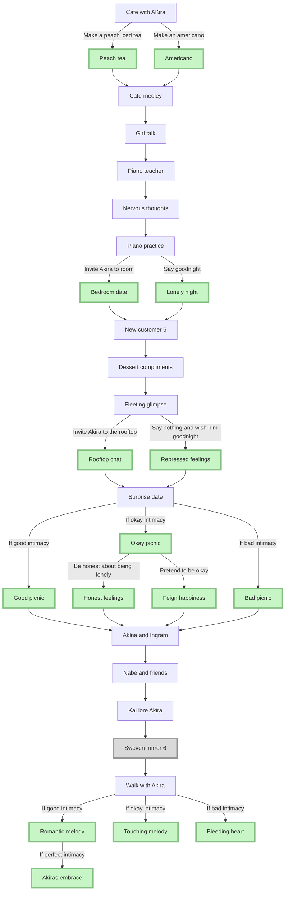

```mermaid
graph TD

%% Define aliases
CH6[Cafe with AKira]
peach-tea[Peach tea]
americano[Americano]
cafe-medley[Cafe medley]
girl-talk[Girl talk]
piano-teacher[Piano teacher]
nervous-thoughts[Nervous thoughts]
piano-practice[Piano practice]
bedroom-date[Bedroom date]
lonely-night[Lonely night]
customer6[New customer 6]
dessert-compliments[Dessert compliments]
fleeting-glimpse[Fleeting glimpse]
rooftop-chat[Rooftop chat]
repressed-feelings[Repressed feelings]
surprise-date[Surprise date]
good-picnic[Good picnic]
ok-picnic[Okay picnic]
honest-feelings[Honest feelings]
feign-happy[Feign happiness]
bad-picnic[Bad picnic]
akina-ingram[Akina and Ingram]
nabe-dinner[Nabe and friends]
kai-lore[Kai lore Akira]
mirror6[Sweven mirror 6]
walk-akira[Walk with Akira]
good-piano[Romantic melody]
ok-piano[Touching melody]
bad-piano[Bleeding heart]
embrace-akira[Akiras embrace]

%% Define node formatting for routes
classDef spirit-route fill:#d9d9d9,stroke:#999999,stroke-width:4px
classDef emi-route fill:#ffbcca,stroke:#f393a7,stroke-width:4px
classDef akira-route fill:#c7f5c5,stroke:#86c083,stroke-width:4px

%% Establish node connections
CH6--Make a peach iced tea-->peach-tea
CH6--Make an americano -->americano
peach-tea & americano-->cafe-medley-->girl-talk-->piano-teacher-->nervous-thoughts-->piano-practice
piano-practice--Invite Akira to room-->bedroom-date
piano-practice--Say goodnight-->lonely-night
bedroom-date & lonely-night-->customer6-->dessert-compliments-->fleeting-glimpse
fleeting-glimpse--Invite Akira to the rooftop-->rooftop-chat
fleeting-glimpse--Say nothing and wish him goodnight-->repressed-feelings
rooftop-chat & repressed-feelings-->surprise-date
surprise-date--If good intimacy-->good-picnic
surprise-date--If okay intimacy-->ok-picnic
ok-picnic--Be honest about being lonely-->honest-feelings
ok-picnic--Pretend to be okay-->feign-happy
surprise-date--If bad intimacy-->bad-picnic
good-picnic & honest-feelings & feign-happy & bad-picnic-->akina-ingram-->nabe-dinner-->kai-lore-->mirror6-->walk-akira
walk-akira--If good intimacy-->good-piano--If perfect intimacy-->embrace-akira
walk-akira--if okay intimacy-->ok-piano
walk-akira--If bad intimacy-->bad-piano

%% Format the routes & link to script files accordingly
%%---------------------------------------------------------------------------
%% General storyline
class CH6,cafe-medley,girl-talk,piano-teacher,nervous-thoughts,piano-practice,customer6,dessert-compliments,fleeting-glimpse,surprise-date,akina-ingram,nabe-dinner,kai-lore,walk-akira internal-link

%% Spiritguiding
class mirror6 spirit-route
class mirror6 internal-link

%% Akira decisions
class peach-tea,americano,bedroom-date,lonely-night,rooftop-chat,repressed-feelings,good-picnic,ok-picnic,honest-feelings,feign-happy,bad-picnic,good-piano,ok-piano,bad-piano,embrace-akira akira-route
class peach-tea,americano,bedroom-date,lonely-night,rooftop-chat,repressed-feelings,good-picnic,ok-picnic,honest-feelings,feign-happy,bad-picnic,good-piano,ok-piano,bad-piano,embrace-akira internal-link

```
