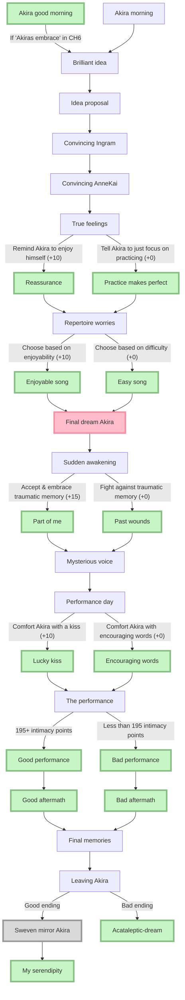

```mermaid
graph TD

%% Define aliases
CH7-good[Akira good morning]
CH7[Akira morning]
brilliant-idea[Brilliant idea]
proposal-akira[Idea proposal]
convince-ingram[Convincing Ingram]
convince-annekai[Convincing AnneKai]
true-feelings[True feelings]
reassurance[Reassurance]
practice-more[Practice makes perfect]
repertoire-worries[Repertoire worries]
enjoyable-song[Enjoyable song]
easy-song[Easy song]
dreaming-of-akira[Final dream Akira]
sudden-awakening[Sudden awakening]
part-of-me[Part of me]
past-wounds[Past wounds]
mysterious-voice[Mysterious voice]
performance-day[Performance day]
lucky-kiss[Lucky kiss]
encouraging-words[Encouraging words]
the-performance[The performance]
good-performance[Good performance]
bad-performance[Bad performance]
good-aftermath[Good aftermath]
bad-aftermath[Bad aftermath]
final-memories[Final memories]
leaving-akira[Leaving Akira]
mirror7[Sweven mirror Akira]
my-serendipity[My serendipity]
acataleptic-dream[Acataleptic-dream]

%% Define node formatting for routes
classDef spirit-route fill:#d9d9d9,stroke:#999999,stroke-width:4px
classDef emi-route fill:#ffbcca,stroke:#f393a7,stroke-width:4px
classDef akira-route fill:#c7f5c5,stroke:#86c083,stroke-width:4px

%% Establish node connections
CH7-good--If 'Akiras embrace' in CH6-->brilliant-idea
CH7-->brilliant-idea
brilliant-idea-->proposal-akira-->convince-ingram-->convince-annekai-->true-feelings
true-feelings--Remind Akira to enjoy himself (+10)-->reassurance
true-feelings--Tell Akira to just focus on practicing (+0)-->practice-more
reassurance & practice-more-->repertoire-worries
repertoire-worries--Choose based on enjoyability (+10)-->enjoyable-song
repertoire-worries--Choose based on difficulty (+0)-->easy-song
enjoyable-song & easy-song-->dreaming-of-akira-->sudden-awakening
sudden-awakening--Accept & embrace traumatic memory (+15)-->part-of-me
sudden-awakening--Fight against traumatic memory (+0)-->past-wounds
part-of-me & past-wounds-->mysterious-voice-->performance-day
performance-day--Comfort Akira with a kiss (+10)-->lucky-kiss
performance-day--Comfort Akira with encouraging words (+0)-->encouraging-words
lucky-kiss & encouraging-words-->the-performance
the-performance--195+ intimacy points-->good-performance-->good-aftermath-->final-memories
the-performance--Less than 195 intimacy points-->bad-performance-->bad-aftermath-->final-memories
final-memories-->leaving-akira
leaving-akira--Good ending-->mirror7-->my-serendipity
leaving-akira--Bad ending-->acataleptic-dream

%% Format the routes & link to script files accordingly
%%---------------------------------------------------------------------------
%% General storyline
class dreaming-of-akira emi-route
class CH7,brilliant-idea,proposal-akira,convince-ingram,convince-annekai,true-feelings,repertoire-worries,dreaming-of-akira,sudden-awakening,mysterious-voice,performance-day,the-performance,final-memories,leaving-akira internal-link

%% Spiritguiding
class mirror7 spirit-route
class mirror7 internal-link

%% Akira decisions
class CH7-good,reassurance,practice-more,enjoyable-song,easy-song,part-of-me,past-wounds,lucky-kiss,encouraging-words,good-performance,bad-performance,good-aftermath,bad-aftermath,my-serendipity,acataleptic-dream akira-route
class CH7-good,reassurance,practice-more,enjoyable-song,easy-song,part-of-me,past-wounds,lucky-kiss,encouraging-words,good-performance,bad-performance,good-aftermath,bad-aftermath,my-serendipity,acataleptic-dream internal-link

```
